# ggplot_quarto


- [Example dataset](#example-dataset)
- [Importing Data](#importing-data)
  - [From excel](#from-excel)
  - [From csv/tsv](#from-csvtsv)
  - [Hiding Code](#hiding-code)
- [Data cleanup](#data-cleanup)
  - [Remove a pattern from a column
    name](#remove-a-pattern-from-a-column-name)
  - [Example dataset:](#example-dataset-1)
  - [TidyR](#tidyr)
    - [`gather()` (outdated, use pivot_longer
      now!)](#gather-outdated-use-pivot_longer-now)
    - [`pivot_longer()`](#pivot_longer)
- [Base Plots](#base-plots)
  - [Line](#line)
  - [Histogram](#histogram)
  - [Pie](#pie)
  - [Scatterplot](#scatterplot)
  - [Density Scatterplots](#density-scatterplots)
    - [2D Density plot with Hex bins](#2d-density-plot-with-hex-bins)
    - [2d distribution with geom_density_2d or
      stat_density_2d](#2d-distribution-with-geom_density_2d-or-stat_density_2d)
  - [Scatterplot + Smoothing Line](#scatterplot--smoothing-line)
  - [Add Linear model](#add-linear-model)
  - [Text Scatter Plot](#text-scatter-plot)
  - [Barplots - Stacked](#barplots---stacked)
    - [Manual Color Scheme and
      Labeling](#manual-color-scheme-and-labeling)
  - [Barplots - side by side](#barplots---side-by-side)
  - [Violin Plot](#violin-plot)
  - [Dotplot (2 category variables)](#dotplot-2-category-variables)
  - [Ridgeline](#ridgeline)
  - [Marginal Histograms](#marginal-histograms)
- [Add-ons](#add-ons)
  - [Set Properties to Categorical
    Variable](#set-properties-to-categorical-variable)
  - [Faceting](#faceting)
    - [Subplots based on a categorical
      variable](#subplots-based-on-a-categorical-variable)
    - [Subplots in columns and rows (split by 2
      variables)](#subplots-in-columns-and-rows-split-by-2-variables)
    - [Reordering subplots:](#reordering-subplots)
    - [faceting other plot types:](#faceting-other-plot-types)
    - [Faceting and zooming on subset of
      plot](#faceting-and-zooming-on-subset-of-plot)
  - [Positioning](#positioning)
    - [Scatterplot positioning](#scatterplot-positioning)
    - [Legend positioning](#legend-positioning)
  - [Plot on log scale](#plot-on-log-scale)
  - [Set x and y axes](#set-x-and-y-axes)
    - [Strategy 1: Scale_x_continuous](#strategy-1-scale_x_continuous)
    - [Strategy 2: coord_cartesian](#strategy-2-coord_cartesian)
  - [Add regression line](#add-regression-line)
  - [Add x = y line](#add-x--y-line)
  - [Manual tick lines](#manual-tick-lines)
- [Coloring](#coloring)
  - [`Viridis` Colorblind-friendly
    library](#viridis-colorblind-friendly-library)
    - [Continuous Color Schemes](#continuous-color-schemes)
    - [Discrete Color Schemes](#discrete-color-schemes)
  - [R Color Brewer](#r-color-brewer)
  - [non Rcolorbrewer palettes](#non-rcolorbrewer-palettes)
  - [Manual Color Scheme and
    Labeling](#manual-color-scheme-and-labeling-1)
- [Labels](#labels)
  - [custom legend labels](#custom-legend-labels)
  - [rotate labels](#rotate-labels)
  - [Format Date Labels](#format-date-labels)
  - [format axes numbers](#format-axes-numbers)
    - [sci notation -\> full numbers](#sci-notation---full-numbers)
    - [full numbers -\> Add commas](#full-numbers---add-commas)
    - [Full numbers -\> Millions or
      Billions](#full-numbers---millions-or-billions)
  - [Linebreak in plot labels](#linebreak-in-plot-labels)
- [Combining plots](#combining-plots)
  - [GridExtra - Gridarrange](#gridextra---gridarrange)

# Example dataset

Titration of mitotic/interphase HeLa-S3 cells: from our preprint
[here](https://pubmed.ncbi.nlm.nih.gov/41394721/)


``` r
knitr::include_graphics("/Users/laurenpatel/Documents/Research/H3K9ac_titration_dataset_example.png")
```


# Importing Data

## From excel

``` r
#dataframe <- read_excel("~/Research/path/to/folder/file.xlsx")
#View(dataframe)
```

## From csv/tsv

`read.delim()`

Our example dataset is generated with HOMER `annotatePeaks`, quantifying
H3K9ac ChIP-seq signal at RefSeq TSSs.

``` r
hist_tss_hg38_tutorial_spikenorm_LP78 <- read.delim("~/Documents/Research/LP_78/hist_tss_hg38_LP78_readnorm_vs_spikenorm.txt")
```

Before cleaning, the headers are messy, and contain the original
function used to make the file:

``` r
knitr::kable(head(hist_tss_hg38_tutorial_spikenorm_LP78))
```

| Distance.from.Center..cmd.annotatePeaks.pl.tss.hg38..size.4000..hist.25..d.hg38_nodups_tagdirs.HelaS3_100sync_0inter_1_H3K9ac_1.hg38.GCcheck.tagdir.hg38_nodups_tagdirs.HelaS3_100sync_0inter_1_H3K9ac_2.hg38.GCcheck.tagdir.hg38_nodups_tagdirs.HelaS3_100sync_0inter_1_H3K9ac_3.hg38.GCcheck.tagdir.hg38_nodups_tagdirs.HelaS3_100sync_0inter_1_input_1.hg38.GCcheck.tagdir.hg38_nodups_tagdirs.HelaS3_0sync_100inter_1_H3K9ac_1.hg38.GCcheck.tagdir.hg38_nodups_tagdirs.HelaS3_0sync_100inter_1_H3K9ac_2.hg38.GCcheck.tagdir.hg38_nodups_tagdirs.HelaS3_0sync_100inter_1_H3K9ac_3.hg38.GCcheck.tagdir.hg38_nodups_tagdirs.HelaS3_0sync_100inter_1_input_1.hg38.GCcheck.tagdir.hg38_normalized_tagdirs.HelaS3_100sync_0inter_1_H3K9ac_1.fly.normalized.tagdir.hg38_normalized_tagdirs.HelaS3_100sync_0inter_1_H3K9ac_1.normalized.tagdir.hg38_normalized_tagdirs.HelaS3_100sync_0inter_1_H3K9ac_1.yeast.normalized.tagdir.hg38_normalized_tagdirs.HelaS3_100sync_0inter_1_H3K9ac_2.fly.normalized.tagdir.hg38_normalized_tagdirs.HelaS3_100sync_0inter_1_H3K9ac_2.normalized.tagdir.hg38_normalized_tagdirs.HelaS3_100sync_0inter_1_H3K9ac_2.yeast.normalized.tagdir.hg38_normalized_tagdirs.HelaS3_100sync_0inter_1_H3K9ac_3.fly.normalized.tagdir.hg38_normalized_tagdirs.HelaS3_100sync_0inter_1_H3K9ac_3.normalized.tagdir.hg38_normalized_tagdirs.HelaS3_100sync_0inter_1_H3K9ac_3.yeast.normalized.tagdir.hg38_normalized_tagdirs.HelaS3_0sync_100inter_1_H3K9ac_1.fly.normalized.tagdir.hg38_normalized_tagdirs.HelaS3_0sync_100inter_1_H3K9ac_1.normalized.tagdir.hg38_normalized_tagdirs.HelaS3_0sync_100inter_1_H3K9ac_1.yeast.normalized.tagdir.hg38_normalized_tagdirs.HelaS3_0sync_100inter_1_H3K9ac_2.fly.normalized.tagdir.hg38_normalized_tagdirs.HelaS3_0sync_100inter_1_H3K9ac_2.normalized.tagdir.hg38_normalized_tagdirs.HelaS3_0sync_100inter_1_H3K9ac_2.yeast.normalized.tagdir.hg38_normalized_tagdirs.HelaS3_0sync_100inter_1_H3K9ac_3.fly.normalized.tagdir.hg38_normalized_tagdirs.HelaS3_0sync_100inter_1_H3K9ac_3.normalized.tagdir.hg38_normalized_tagdirs.HelaS3_0sync_100inter_1_H3K9ac_3.yeast.normalized.tagdir. | hg38_nodups_tagdirs.HelaS3_100sync_0inter_1_H3K9ac_1.hg38.GCcheck.tagdir.Coverage | hg38_nodups_tagdirs.HelaS3_100sync_0inter_1_H3K9ac_1.hg38.GCcheck.tagdir…Tags | hg38_nodups_tagdirs.HelaS3_100sync_0inter_1_H3K9ac_1.hg38.GCcheck.tagdir…Tags.1 | hg38_nodups_tagdirs.HelaS3_100sync_0inter_1_H3K9ac_2.hg38.GCcheck.tagdir.Coverage | hg38_nodups_tagdirs.HelaS3_100sync_0inter_1_H3K9ac_2.hg38.GCcheck.tagdir…Tags | hg38_nodups_tagdirs.HelaS3_100sync_0inter_1_H3K9ac_2.hg38.GCcheck.tagdir…Tags.1 | hg38_nodups_tagdirs.HelaS3_100sync_0inter_1_H3K9ac_3.hg38.GCcheck.tagdir.Coverage | hg38_nodups_tagdirs.HelaS3_100sync_0inter_1_H3K9ac_3.hg38.GCcheck.tagdir…Tags | hg38_nodups_tagdirs.HelaS3_100sync_0inter_1_H3K9ac_3.hg38.GCcheck.tagdir…Tags.1 | hg38_nodups_tagdirs.HelaS3_100sync_0inter_1_input_1.hg38.GCcheck.tagdir.Coverage | hg38_nodups_tagdirs.HelaS3_100sync_0inter_1_input_1.hg38.GCcheck.tagdir…Tags | hg38_nodups_tagdirs.HelaS3_100sync_0inter_1_input_1.hg38.GCcheck.tagdir…Tags.1 | hg38_nodups_tagdirs.HelaS3_0sync_100inter_1_H3K9ac_1.hg38.GCcheck.tagdir.Coverage | hg38_nodups_tagdirs.HelaS3_0sync_100inter_1_H3K9ac_1.hg38.GCcheck.tagdir…Tags | hg38_nodups_tagdirs.HelaS3_0sync_100inter_1_H3K9ac_1.hg38.GCcheck.tagdir…Tags.1 | hg38_nodups_tagdirs.HelaS3_0sync_100inter_1_H3K9ac_2.hg38.GCcheck.tagdir.Coverage | hg38_nodups_tagdirs.HelaS3_0sync_100inter_1_H3K9ac_2.hg38.GCcheck.tagdir…Tags | hg38_nodups_tagdirs.HelaS3_0sync_100inter_1_H3K9ac_2.hg38.GCcheck.tagdir…Tags.1 | hg38_nodups_tagdirs.HelaS3_0sync_100inter_1_H3K9ac_3.hg38.GCcheck.tagdir.Coverage | hg38_nodups_tagdirs.HelaS3_0sync_100inter_1_H3K9ac_3.hg38.GCcheck.tagdir…Tags | hg38_nodups_tagdirs.HelaS3_0sync_100inter_1_H3K9ac_3.hg38.GCcheck.tagdir…Tags.1 | hg38_nodups_tagdirs.HelaS3_0sync_100inter_1_input_1.hg38.GCcheck.tagdir.Coverage | hg38_nodups_tagdirs.HelaS3_0sync_100inter_1_input_1.hg38.GCcheck.tagdir…Tags | hg38_nodups_tagdirs.HelaS3_0sync_100inter_1_input_1.hg38.GCcheck.tagdir…Tags.1 | hg38_normalized_tagdirs.HelaS3_100sync_0inter_1_H3K9ac_1.fly.normalized.tagdir.Coverage | hg38_normalized_tagdirs.HelaS3_100sync_0inter_1_H3K9ac_1.fly.normalized.tagdir…Tags | hg38_normalized_tagdirs.HelaS3_100sync_0inter_1_H3K9ac_1.fly.normalized.tagdir…Tags.1 | hg38_normalized_tagdirs.HelaS3_100sync_0inter_1_H3K9ac_1.normalized.tagdir.Coverage | hg38_normalized_tagdirs.HelaS3_100sync_0inter_1_H3K9ac_1.normalized.tagdir…Tags | hg38_normalized_tagdirs.HelaS3_100sync_0inter_1_H3K9ac_1.normalized.tagdir…Tags.1 | hg38_normalized_tagdirs.HelaS3_100sync_0inter_1_H3K9ac_1.yeast.normalized.tagdir.Coverage | hg38_normalized_tagdirs.HelaS3_100sync_0inter_1_H3K9ac_1.yeast.normalized.tagdir…Tags | hg38_normalized_tagdirs.HelaS3_100sync_0inter_1_H3K9ac_1.yeast.normalized.tagdir…Tags.1 | hg38_normalized_tagdirs.HelaS3_100sync_0inter_1_H3K9ac_2.fly.normalized.tagdir.Coverage | hg38_normalized_tagdirs.HelaS3_100sync_0inter_1_H3K9ac_2.fly.normalized.tagdir…Tags | hg38_normalized_tagdirs.HelaS3_100sync_0inter_1_H3K9ac_2.fly.normalized.tagdir…Tags.1 | hg38_normalized_tagdirs.HelaS3_100sync_0inter_1_H3K9ac_2.normalized.tagdir.Coverage | hg38_normalized_tagdirs.HelaS3_100sync_0inter_1_H3K9ac_2.normalized.tagdir…Tags | hg38_normalized_tagdirs.HelaS3_100sync_0inter_1_H3K9ac_2.normalized.tagdir…Tags.1 | hg38_normalized_tagdirs.HelaS3_100sync_0inter_1_H3K9ac_2.yeast.normalized.tagdir.Coverage | hg38_normalized_tagdirs.HelaS3_100sync_0inter_1_H3K9ac_2.yeast.normalized.tagdir…Tags | hg38_normalized_tagdirs.HelaS3_100sync_0inter_1_H3K9ac_2.yeast.normalized.tagdir…Tags.1 | hg38_normalized_tagdirs.HelaS3_100sync_0inter_1_H3K9ac_3.fly.normalized.tagdir.Coverage | hg38_normalized_tagdirs.HelaS3_100sync_0inter_1_H3K9ac_3.fly.normalized.tagdir…Tags | hg38_normalized_tagdirs.HelaS3_100sync_0inter_1_H3K9ac_3.fly.normalized.tagdir…Tags.1 | hg38_normalized_tagdirs.HelaS3_100sync_0inter_1_H3K9ac_3.normalized.tagdir.Coverage | hg38_normalized_tagdirs.HelaS3_100sync_0inter_1_H3K9ac_3.normalized.tagdir…Tags | hg38_normalized_tagdirs.HelaS3_100sync_0inter_1_H3K9ac_3.normalized.tagdir…Tags.1 | hg38_normalized_tagdirs.HelaS3_100sync_0inter_1_H3K9ac_3.yeast.normalized.tagdir.Coverage | hg38_normalized_tagdirs.HelaS3_100sync_0inter_1_H3K9ac_3.yeast.normalized.tagdir…Tags | hg38_normalized_tagdirs.HelaS3_100sync_0inter_1_H3K9ac_3.yeast.normalized.tagdir…Tags.1 | hg38_normalized_tagdirs.HelaS3_0sync_100inter_1_H3K9ac_1.fly.normalized.tagdir.Coverage | hg38_normalized_tagdirs.HelaS3_0sync_100inter_1_H3K9ac_1.fly.normalized.tagdir…Tags | hg38_normalized_tagdirs.HelaS3_0sync_100inter_1_H3K9ac_1.fly.normalized.tagdir…Tags.1 | hg38_normalized_tagdirs.HelaS3_0sync_100inter_1_H3K9ac_1.normalized.tagdir.Coverage | hg38_normalized_tagdirs.HelaS3_0sync_100inter_1_H3K9ac_1.normalized.tagdir…Tags | hg38_normalized_tagdirs.HelaS3_0sync_100inter_1_H3K9ac_1.normalized.tagdir…Tags.1 | hg38_normalized_tagdirs.HelaS3_0sync_100inter_1_H3K9ac_1.yeast.normalized.tagdir.Coverage | hg38_normalized_tagdirs.HelaS3_0sync_100inter_1_H3K9ac_1.yeast.normalized.tagdir…Tags | hg38_normalized_tagdirs.HelaS3_0sync_100inter_1_H3K9ac_1.yeast.normalized.tagdir…Tags.1 | hg38_normalized_tagdirs.HelaS3_0sync_100inter_1_H3K9ac_2.fly.normalized.tagdir.Coverage | hg38_normalized_tagdirs.HelaS3_0sync_100inter_1_H3K9ac_2.fly.normalized.tagdir…Tags | hg38_normalized_tagdirs.HelaS3_0sync_100inter_1_H3K9ac_2.fly.normalized.tagdir…Tags.1 | hg38_normalized_tagdirs.HelaS3_0sync_100inter_1_H3K9ac_2.normalized.tagdir.Coverage | hg38_normalized_tagdirs.HelaS3_0sync_100inter_1_H3K9ac_2.normalized.tagdir…Tags | hg38_normalized_tagdirs.HelaS3_0sync_100inter_1_H3K9ac_2.normalized.tagdir…Tags.1 | hg38_normalized_tagdirs.HelaS3_0sync_100inter_1_H3K9ac_2.yeast.normalized.tagdir.Coverage | hg38_normalized_tagdirs.HelaS3_0sync_100inter_1_H3K9ac_2.yeast.normalized.tagdir…Tags | hg38_normalized_tagdirs.HelaS3_0sync_100inter_1_H3K9ac_2.yeast.normalized.tagdir…Tags.1 | hg38_normalized_tagdirs.HelaS3_0sync_100inter_1_H3K9ac_3.fly.normalized.tagdir.Coverage | hg38_normalized_tagdirs.HelaS3_0sync_100inter_1_H3K9ac_3.fly.normalized.tagdir…Tags | hg38_normalized_tagdirs.HelaS3_0sync_100inter_1_H3K9ac_3.fly.normalized.tagdir…Tags.1 | hg38_normalized_tagdirs.HelaS3_0sync_100inter_1_H3K9ac_3.normalized.tagdir.Coverage | hg38_normalized_tagdirs.HelaS3_0sync_100inter_1_H3K9ac_3.normalized.tagdir…Tags | hg38_normalized_tagdirs.HelaS3_0sync_100inter_1_H3K9ac_3.normalized.tagdir…Tags.1 | hg38_normalized_tagdirs.HelaS3_0sync_100inter_1_H3K9ac_3.yeast.normalized.tagdir.Coverage | hg38_normalized_tagdirs.HelaS3_0sync_100inter_1_H3K9ac_3.yeast.normalized.tagdir…Tags | hg38_normalized_tagdirs.HelaS3_0sync_100inter_1_H3K9ac_3.yeast.normalized.tagdir…Tags.1 |
|---:|---:|---:|---:|---:|---:|---:|---:|---:|---:|---:|---:|---:|---:|---:|---:|---:|---:|---:|---:|---:|---:|---:|---:|---:|---:|---:|---:|---:|---:|---:|---:|---:|---:|---:|---:|---:|---:|---:|---:|---:|---:|---:|---:|---:|---:|---:|---:|---:|---:|---:|---:|---:|---:|---:|---:|---:|---:|---:|---:|---:|---:|---:|---:|---:|---:|---:|---:|---:|---:|---:|---:|---:|---:|---:|---:|---:|---:|---:|
| -2000 | 0.7488139 | 0.0030869 | 0.0031685 | 0.7391999 | 0.0032712 | 0.0031230 | 0.8627247 | 0.0037483 | 0.0037099 | 0.3422466 | 0.0014854 | 0.0014811 | 0.6880715 | 0.0031877 | 0.0028710 | 0.8437267 | 0.0036737 | 0.0035004 | 0.8276442 | 0.0036873 | 0.0034055 | 0.3696493 | 0.0016236 | 0.0015289 | 0.8027825 | 0.0033094 | 0.0033969 | 0.8027825 | 0.0033094 | 0.0033969 | 0.8027825 | 0.0033094 | 0.0033969 | 0.8213333 | 0.0036347 | 0.0034700 | 0.8150153 | 0.0036067 | 0.0034433 | 0.8086974 | 0.0035788 | 0.0034166 | 0.7375967 | 0.0032046 | 0.0031718 | 0.7375967 | 0.0032046 | 0.0031718 | 0.7441824 | 0.0032332 | 0.0032001 | 3.620835 | 0.0167749 | 0.0151081 | 3.372679 | 0.0156252 | 0.0140726 | 3.147081 | 0.0145800 | 0.0131313 | 2.847577 | 0.0123986 | 0.0118137 | 2.894451 | 0.0126027 | 0.0120082 | 2.917888 | 0.0127048 | 0.0121054 | 2.975045 | 0.0132544 | 0.0122413 | 2.840833 | 0.0126565 | 0.0116891 | 2.728989 | 0.0121582 | 0.0112289 |
| -1975 | 0.7565188 | 0.0034422 | 0.0033266 | 0.7447724 | 0.0032638 | 0.0032016 | 0.8702629 | 0.0038764 | 0.0034808 | 0.3472471 | 0.0016943 | 0.0014726 | 0.6985654 | 0.0032755 | 0.0029090 | 0.8521428 | 0.0038320 | 0.0036419 | 0.8359049 | 0.0037467 | 0.0034642 | 0.3729866 | 0.0015548 | 0.0015730 | 0.8110426 | 0.0036903 | 0.0035664 | 0.8110426 | 0.0036903 | 0.0035664 | 0.8110426 | 0.0036903 | 0.0035664 | 0.8275249 | 0.0036265 | 0.0035573 | 0.8211593 | 0.0035986 | 0.0035300 | 0.8147937 | 0.0035707 | 0.0035026 | 0.7440416 | 0.0033142 | 0.0029759 | 0.7440416 | 0.0033142 | 0.0029759 | 0.7506848 | 0.0033438 | 0.0030025 | 3.676057 | 0.0172364 | 0.0153078 | 3.424116 | 0.0160551 | 0.0142586 | 3.195078 | 0.0149812 | 0.0133049 | 2.875982 | 0.0129331 | 0.0122913 | 2.923323 | 0.0131460 | 0.0124936 | 2.946994 | 0.0132525 | 0.0125948 | 3.004739 | 0.0134679 | 0.0124523 | 2.869187 | 0.0128603 | 0.0118906 | 2.756227 | 0.0123540 | 0.0114224 |
| -1950 | 0.7610299 | 0.0034412 | 0.0030234 | 0.7505470 | 0.0034289 | 0.0031584 | 0.8786081 | 0.0039148 | 0.0035357 | 0.3448308 | 0.0014773 | 0.0015048 | 0.7044309 | 0.0030192 | 0.0029065 | 0.8579789 | 0.0037551 | 0.0035773 | 0.8433318 | 0.0038608 | 0.0033955 | 0.3712774 | 0.0016204 | 0.0015957 | 0.8158789 | 0.0036892 | 0.0032413 | 0.8158789 | 0.0036892 | 0.0032413 | 0.8158789 | 0.0036892 | 0.0032413 | 0.8339411 | 0.0038099 | 0.0035093 | 0.8275261 | 0.0037806 | 0.0034823 | 0.8211112 | 0.0037513 | 0.0034553 | 0.7511764 | 0.0033470 | 0.0030229 | 0.7511764 | 0.0033470 | 0.0030229 | 0.7578833 | 0.0033769 | 0.0030499 | 3.706923 | 0.0158880 | 0.0152947 | 3.452866 | 0.0147991 | 0.0142465 | 3.221906 | 0.0138092 | 0.0132936 | 2.895679 | 0.0126735 | 0.0120733 | 2.943344 | 0.0128822 | 0.0122721 | 2.967177 | 0.0129865 | 0.0123714 | 3.031436 | 0.0138779 | 0.0122054 | 2.894680 | 0.0132518 | 0.0116547 | 2.780716 | 0.0127301 | 0.0111959 |
| -1925 | 0.7750137 | 0.0036108 | 0.0031790 | 0.7585365 | 0.0034241 | 0.0031900 | 0.8855559 | 0.0039809 | 0.0036048 | 0.3447468 | 0.0014494 | 0.0014292 | 0.7112313 | 0.0031803 | 0.0029213 | 0.8703326 | 0.0040440 | 0.0035276 | 0.8598200 | 0.0039512 | 0.0034365 | 0.3711151 | 0.0016230 | 0.0015201 | 0.8308706 | 0.0038710 | 0.0034081 | 0.8308706 | 0.0038710 | 0.0034081 | 0.8308706 | 0.0038710 | 0.0034081 | 0.8428183 | 0.0038046 | 0.0035444 | 0.8363351 | 0.0037753 | 0.0035172 | 0.8298519 | 0.0037461 | 0.0034899 | 0.7571165 | 0.0034035 | 0.0030819 | 0.7571165 | 0.0034035 | 0.0030819 | 0.7638765 | 0.0034339 | 0.0031095 | 3.742709 | 0.0167358 | 0.0153729 | 3.486200 | 0.0155888 | 0.0143193 | 3.253009 | 0.0145461 | 0.0133615 | 2.937373 | 0.0136484 | 0.0119058 | 2.985724 | 0.0138730 | 0.0121017 | 3.009900 | 0.0139853 | 0.0121997 | 3.090704 | 0.0142028 | 0.0123528 | 2.951274 | 0.0135621 | 0.0117956 | 2.835082 | 0.0130281 | 0.0113312 |
| -1900 | 0.7886307 | 0.0037779 | 0.0031990 | 0.7685124 | 0.0035454 | 0.0030982 | 0.8966369 | 0.0041521 | 0.0036662 | 0.3480029 | 0.0015424 | 0.0014862 | 0.7186595 | 0.0032221 | 0.0027951 | 0.8783972 | 0.0039268 | 0.0034666 | 0.8731062 | 0.0039785 | 0.0035926 | 0.3723700 | 0.0015681 | 0.0015016 | 0.8454689 | 0.0040502 | 0.0034296 | 0.8454689 | 0.0040502 | 0.0034296 | 0.8454689 | 0.0040502 | 0.0034296 | 0.8539026 | 0.0039394 | 0.0034425 | 0.8473341 | 0.0039091 | 0.0034160 | 0.8407656 | 0.0038788 | 0.0033895 | 0.7665903 | 0.0035499 | 0.0031344 | 0.7665903 | 0.0035499 | 0.0031344 | 0.7734349 | 0.0035816 | 0.0031624 | 3.781798 | 0.0169557 | 0.0147088 | 3.522610 | 0.0157937 | 0.0137007 | 3.286984 | 0.0147372 | 0.0127843 | 2.964590 | 0.0132530 | 0.0116998 | 3.013390 | 0.0134711 | 0.0118924 | 3.037790 | 0.0135802 | 0.0119887 | 3.138463 | 0.0143011 | 0.0129139 | 2.996878 | 0.0136560 | 0.0123314 | 2.878891 | 0.0131183 | 0.0118459 |
| -1875 | 0.7940424 | 0.0035592 | 0.0032270 | 0.7803604 | 0.0035934 | 0.0031684 | 0.9079738 | 0.0040340 | 0.0039945 | 0.3486296 | 0.0015059 | 0.0015501 | 0.7270867 | 0.0031303 | 0.0029895 | 0.8968629 | 0.0041040 | 0.0036036 | 0.8824732 | 0.0040739 | 0.0037280 | 0.3727919 | 0.0015798 | 0.0015396 | 0.8512707 | 0.0038158 | 0.0034596 | 0.8512707 | 0.0038158 | 0.0034596 | 0.8512707 | 0.0038158 | 0.0034596 | 0.8670671 | 0.0039927 | 0.0035204 | 0.8603973 | 0.0039620 | 0.0034933 | 0.8537276 | 0.0039313 | 0.0034663 | 0.7762829 | 0.0034489 | 0.0034151 | 0.7762829 | 0.0034489 | 0.0034151 | 0.7832140 | 0.0034797 | 0.0034456 | 3.826145 | 0.0164725 | 0.0157317 | 3.563917 | 0.0153435 | 0.0146535 | 3.325528 | 0.0143172 | 0.0136733 | 3.026912 | 0.0138510 | 0.0121620 | 3.076738 | 0.0140790 | 0.0123622 | 3.101651 | 0.0141930 | 0.0124623 | 3.172133 | 0.0146440 | 0.0134007 | 3.029030 | 0.0139834 | 0.0127962 | 2.909776 | 0.0134329 | 0.0122924 |

Use `read.table` function: first argument specify path to file, sep
argument tells R what separates the columns of your data (space, comma,
or tab). Example below is for tab separated TSV. header = T (header =
True) means the first row is the headers for columns.

``` r
RGFP_input_tagLen <- read.table("~/Research/LH_57_csRNA/Hela_sync_RGFP_input/tagLengthDistribution.txt", 
      sep="\t", header = T)
```

## Hiding Code

You can embed plots without showing code:


Note that the `echo = FALSE` parameter was added to the code chunk to
prevent printing of the R code that generated the plot.

# Data cleanup

## Remove a pattern from a column name

Below example replaces “*synchela*” with “\_”

``` r
#dataframe %>% rename_with(~ gsub("_synchela_", "_", .x), contains("_synchela"))
```

## Example dataset:

``` r
# fix the name of column 1, removing the record of the command used to make the file
colnames(hist_tss_hg38_tutorial_spikenorm_LP78)[1] <- "Distance_from_tss"

hist_tss_hg38_tutorial_spikenorm_LP78 <- hist_tss_hg38_tutorial_spikenorm_LP78 %>% 
      ### first rename_with uses are specific to my sample name
      # get rid of any prefix before cell type (ex: directory path)
    rename_with(~ gsub(".GCcheck.tagdir", ".readnorm.tagdir", .x), contains("Hela")) %>% 
    rename_with(~ gsub(".+Hela", "Hela", .x), contains("Hela")) %>% 
      ### below two uses of rename_with are general to HOMER output
    rename_with(~ gsub("\\.[[:digit:]]$", "_minus", .x), contains("Tags")) %>% 
    rename_with(~ gsub("\\.\\.\\.", "_", .x), contains("Tags"))

knitr::kable(head(hist_tss_hg38_tutorial_spikenorm_LP78))    
```

| Distance_from_tss | HelaS3_100sync_0inter_1_H3K9ac_1.hg38.readnorm.tagdir.Coverage | HelaS3_100sync_0inter_1_H3K9ac_1.hg38.readnorm.tagdir_Tags | HelaS3_100sync_0inter_1_H3K9ac_1.hg38.readnorm.tagdir_Tags_minus | HelaS3_100sync_0inter_1_H3K9ac_2.hg38.readnorm.tagdir.Coverage | HelaS3_100sync_0inter_1_H3K9ac_2.hg38.readnorm.tagdir_Tags | HelaS3_100sync_0inter_1_H3K9ac_2.hg38.readnorm.tagdir_Tags_minus | HelaS3_100sync_0inter_1_H3K9ac_3.hg38.readnorm.tagdir.Coverage | HelaS3_100sync_0inter_1_H3K9ac_3.hg38.readnorm.tagdir_Tags | HelaS3_100sync_0inter_1_H3K9ac_3.hg38.readnorm.tagdir_Tags_minus | HelaS3_100sync_0inter_1_input_1.hg38.readnorm.tagdir.Coverage | HelaS3_100sync_0inter_1_input_1.hg38.readnorm.tagdir_Tags | HelaS3_100sync_0inter_1_input_1.hg38.readnorm.tagdir_Tags_minus | HelaS3_0sync_100inter_1_H3K9ac_1.hg38.readnorm.tagdir.Coverage | HelaS3_0sync_100inter_1_H3K9ac_1.hg38.readnorm.tagdir_Tags | HelaS3_0sync_100inter_1_H3K9ac_1.hg38.readnorm.tagdir_Tags_minus | HelaS3_0sync_100inter_1_H3K9ac_2.hg38.readnorm.tagdir.Coverage | HelaS3_0sync_100inter_1_H3K9ac_2.hg38.readnorm.tagdir_Tags | HelaS3_0sync_100inter_1_H3K9ac_2.hg38.readnorm.tagdir_Tags_minus | HelaS3_0sync_100inter_1_H3K9ac_3.hg38.readnorm.tagdir.Coverage | HelaS3_0sync_100inter_1_H3K9ac_3.hg38.readnorm.tagdir_Tags | HelaS3_0sync_100inter_1_H3K9ac_3.hg38.readnorm.tagdir_Tags_minus | HelaS3_0sync_100inter_1_input_1.hg38.readnorm.tagdir.Coverage | HelaS3_0sync_100inter_1_input_1.hg38.readnorm.tagdir_Tags | HelaS3_0sync_100inter_1_input_1.hg38.readnorm.tagdir_Tags_minus | HelaS3_100sync_0inter_1_H3K9ac_1.fly.normalized.tagdir.Coverage | HelaS3_100sync_0inter_1_H3K9ac_1.fly.normalized.tagdir_Tags | HelaS3_100sync_0inter_1_H3K9ac_1.fly.normalized.tagdir_Tags_minus | HelaS3_100sync_0inter_1_H3K9ac_1.normalized.tagdir.Coverage | HelaS3_100sync_0inter_1_H3K9ac_1.normalized.tagdir_Tags | HelaS3_100sync_0inter_1_H3K9ac_1.normalized.tagdir_Tags_minus | HelaS3_100sync_0inter_1_H3K9ac_1.yeast.normalized.tagdir.Coverage | HelaS3_100sync_0inter_1_H3K9ac_1.yeast.normalized.tagdir_Tags | HelaS3_100sync_0inter_1_H3K9ac_1.yeast.normalized.tagdir_Tags_minus | HelaS3_100sync_0inter_1_H3K9ac_2.fly.normalized.tagdir.Coverage | HelaS3_100sync_0inter_1_H3K9ac_2.fly.normalized.tagdir_Tags | HelaS3_100sync_0inter_1_H3K9ac_2.fly.normalized.tagdir_Tags_minus | HelaS3_100sync_0inter_1_H3K9ac_2.normalized.tagdir.Coverage | HelaS3_100sync_0inter_1_H3K9ac_2.normalized.tagdir_Tags | HelaS3_100sync_0inter_1_H3K9ac_2.normalized.tagdir_Tags_minus | HelaS3_100sync_0inter_1_H3K9ac_2.yeast.normalized.tagdir.Coverage | HelaS3_100sync_0inter_1_H3K9ac_2.yeast.normalized.tagdir_Tags | HelaS3_100sync_0inter_1_H3K9ac_2.yeast.normalized.tagdir_Tags_minus | HelaS3_100sync_0inter_1_H3K9ac_3.fly.normalized.tagdir.Coverage | HelaS3_100sync_0inter_1_H3K9ac_3.fly.normalized.tagdir_Tags | HelaS3_100sync_0inter_1_H3K9ac_3.fly.normalized.tagdir_Tags_minus | HelaS3_100sync_0inter_1_H3K9ac_3.normalized.tagdir.Coverage | HelaS3_100sync_0inter_1_H3K9ac_3.normalized.tagdir_Tags | HelaS3_100sync_0inter_1_H3K9ac_3.normalized.tagdir_Tags_minus | HelaS3_100sync_0inter_1_H3K9ac_3.yeast.normalized.tagdir.Coverage | HelaS3_100sync_0inter_1_H3K9ac_3.yeast.normalized.tagdir_Tags | HelaS3_100sync_0inter_1_H3K9ac_3.yeast.normalized.tagdir_Tags_minus | HelaS3_0sync_100inter_1_H3K9ac_1.fly.normalized.tagdir.Coverage | HelaS3_0sync_100inter_1_H3K9ac_1.fly.normalized.tagdir_Tags | HelaS3_0sync_100inter_1_H3K9ac_1.fly.normalized.tagdir_Tags_minus | HelaS3_0sync_100inter_1_H3K9ac_1.normalized.tagdir.Coverage | HelaS3_0sync_100inter_1_H3K9ac_1.normalized.tagdir_Tags | HelaS3_0sync_100inter_1_H3K9ac_1.normalized.tagdir_Tags_minus | HelaS3_0sync_100inter_1_H3K9ac_1.yeast.normalized.tagdir.Coverage | HelaS3_0sync_100inter_1_H3K9ac_1.yeast.normalized.tagdir_Tags | HelaS3_0sync_100inter_1_H3K9ac_1.yeast.normalized.tagdir_Tags_minus | HelaS3_0sync_100inter_1_H3K9ac_2.fly.normalized.tagdir.Coverage | HelaS3_0sync_100inter_1_H3K9ac_2.fly.normalized.tagdir_Tags | HelaS3_0sync_100inter_1_H3K9ac_2.fly.normalized.tagdir_Tags_minus | HelaS3_0sync_100inter_1_H3K9ac_2.normalized.tagdir.Coverage | HelaS3_0sync_100inter_1_H3K9ac_2.normalized.tagdir_Tags | HelaS3_0sync_100inter_1_H3K9ac_2.normalized.tagdir_Tags_minus | HelaS3_0sync_100inter_1_H3K9ac_2.yeast.normalized.tagdir.Coverage | HelaS3_0sync_100inter_1_H3K9ac_2.yeast.normalized.tagdir_Tags | HelaS3_0sync_100inter_1_H3K9ac_2.yeast.normalized.tagdir_Tags_minus | HelaS3_0sync_100inter_1_H3K9ac_3.fly.normalized.tagdir.Coverage | HelaS3_0sync_100inter_1_H3K9ac_3.fly.normalized.tagdir_Tags | HelaS3_0sync_100inter_1_H3K9ac_3.fly.normalized.tagdir_Tags_minus | HelaS3_0sync_100inter_1_H3K9ac_3.normalized.tagdir.Coverage | HelaS3_0sync_100inter_1_H3K9ac_3.normalized.tagdir_Tags | HelaS3_0sync_100inter_1_H3K9ac_3.normalized.tagdir_Tags_minus | HelaS3_0sync_100inter_1_H3K9ac_3.yeast.normalized.tagdir.Coverage | HelaS3_0sync_100inter_1_H3K9ac_3.yeast.normalized.tagdir_Tags | HelaS3_0sync_100inter_1_H3K9ac_3.yeast.normalized.tagdir_Tags_minus |
|---:|---:|---:|---:|---:|---:|---:|---:|---:|---:|---:|---:|---:|---:|---:|---:|---:|---:|---:|---:|---:|---:|---:|---:|---:|---:|---:|---:|---:|---:|---:|---:|---:|---:|---:|---:|---:|---:|---:|---:|---:|---:|---:|---:|---:|---:|---:|---:|---:|---:|---:|---:|---:|---:|---:|---:|---:|---:|---:|---:|---:|---:|---:|---:|---:|---:|---:|---:|---:|---:|---:|---:|---:|---:|---:|---:|---:|---:|---:|
| -2000 | 0.7488139 | 0.0030869 | 0.0031685 | 0.7391999 | 0.0032712 | 0.0031230 | 0.8627247 | 0.0037483 | 0.0037099 | 0.3422466 | 0.0014854 | 0.0014811 | 0.6880715 | 0.0031877 | 0.0028710 | 0.8437267 | 0.0036737 | 0.0035004 | 0.8276442 | 0.0036873 | 0.0034055 | 0.3696493 | 0.0016236 | 0.0015289 | 0.8027825 | 0.0033094 | 0.0033969 | 0.8027825 | 0.0033094 | 0.0033969 | 0.8027825 | 0.0033094 | 0.0033969 | 0.8213333 | 0.0036347 | 0.0034700 | 0.8150153 | 0.0036067 | 0.0034433 | 0.8086974 | 0.0035788 | 0.0034166 | 0.7375967 | 0.0032046 | 0.0031718 | 0.7375967 | 0.0032046 | 0.0031718 | 0.7441824 | 0.0032332 | 0.0032001 | 3.620835 | 0.0167749 | 0.0151081 | 3.372679 | 0.0156252 | 0.0140726 | 3.147081 | 0.0145800 | 0.0131313 | 2.847577 | 0.0123986 | 0.0118137 | 2.894451 | 0.0126027 | 0.0120082 | 2.917888 | 0.0127048 | 0.0121054 | 2.975045 | 0.0132544 | 0.0122413 | 2.840833 | 0.0126565 | 0.0116891 | 2.728989 | 0.0121582 | 0.0112289 |
| -1975 | 0.7565188 | 0.0034422 | 0.0033266 | 0.7447724 | 0.0032638 | 0.0032016 | 0.8702629 | 0.0038764 | 0.0034808 | 0.3472471 | 0.0016943 | 0.0014726 | 0.6985654 | 0.0032755 | 0.0029090 | 0.8521428 | 0.0038320 | 0.0036419 | 0.8359049 | 0.0037467 | 0.0034642 | 0.3729866 | 0.0015548 | 0.0015730 | 0.8110426 | 0.0036903 | 0.0035664 | 0.8110426 | 0.0036903 | 0.0035664 | 0.8110426 | 0.0036903 | 0.0035664 | 0.8275249 | 0.0036265 | 0.0035573 | 0.8211593 | 0.0035986 | 0.0035300 | 0.8147937 | 0.0035707 | 0.0035026 | 0.7440416 | 0.0033142 | 0.0029759 | 0.7440416 | 0.0033142 | 0.0029759 | 0.7506848 | 0.0033438 | 0.0030025 | 3.676057 | 0.0172364 | 0.0153078 | 3.424116 | 0.0160551 | 0.0142586 | 3.195078 | 0.0149812 | 0.0133049 | 2.875982 | 0.0129331 | 0.0122913 | 2.923323 | 0.0131460 | 0.0124936 | 2.946994 | 0.0132525 | 0.0125948 | 3.004739 | 0.0134679 | 0.0124523 | 2.869187 | 0.0128603 | 0.0118906 | 2.756227 | 0.0123540 | 0.0114224 |
| -1950 | 0.7610299 | 0.0034412 | 0.0030234 | 0.7505470 | 0.0034289 | 0.0031584 | 0.8786081 | 0.0039148 | 0.0035357 | 0.3448308 | 0.0014773 | 0.0015048 | 0.7044309 | 0.0030192 | 0.0029065 | 0.8579789 | 0.0037551 | 0.0035773 | 0.8433318 | 0.0038608 | 0.0033955 | 0.3712774 | 0.0016204 | 0.0015957 | 0.8158789 | 0.0036892 | 0.0032413 | 0.8158789 | 0.0036892 | 0.0032413 | 0.8158789 | 0.0036892 | 0.0032413 | 0.8339411 | 0.0038099 | 0.0035093 | 0.8275261 | 0.0037806 | 0.0034823 | 0.8211112 | 0.0037513 | 0.0034553 | 0.7511764 | 0.0033470 | 0.0030229 | 0.7511764 | 0.0033470 | 0.0030229 | 0.7578833 | 0.0033769 | 0.0030499 | 3.706923 | 0.0158880 | 0.0152947 | 3.452866 | 0.0147991 | 0.0142465 | 3.221906 | 0.0138092 | 0.0132936 | 2.895679 | 0.0126735 | 0.0120733 | 2.943344 | 0.0128822 | 0.0122721 | 2.967177 | 0.0129865 | 0.0123714 | 3.031436 | 0.0138779 | 0.0122054 | 2.894680 | 0.0132518 | 0.0116547 | 2.780716 | 0.0127301 | 0.0111959 |
| -1925 | 0.7750137 | 0.0036108 | 0.0031790 | 0.7585365 | 0.0034241 | 0.0031900 | 0.8855559 | 0.0039809 | 0.0036048 | 0.3447468 | 0.0014494 | 0.0014292 | 0.7112313 | 0.0031803 | 0.0029213 | 0.8703326 | 0.0040440 | 0.0035276 | 0.8598200 | 0.0039512 | 0.0034365 | 0.3711151 | 0.0016230 | 0.0015201 | 0.8308706 | 0.0038710 | 0.0034081 | 0.8308706 | 0.0038710 | 0.0034081 | 0.8308706 | 0.0038710 | 0.0034081 | 0.8428183 | 0.0038046 | 0.0035444 | 0.8363351 | 0.0037753 | 0.0035172 | 0.8298519 | 0.0037461 | 0.0034899 | 0.7571165 | 0.0034035 | 0.0030819 | 0.7571165 | 0.0034035 | 0.0030819 | 0.7638765 | 0.0034339 | 0.0031095 | 3.742709 | 0.0167358 | 0.0153729 | 3.486200 | 0.0155888 | 0.0143193 | 3.253009 | 0.0145461 | 0.0133615 | 2.937373 | 0.0136484 | 0.0119058 | 2.985724 | 0.0138730 | 0.0121017 | 3.009900 | 0.0139853 | 0.0121997 | 3.090704 | 0.0142028 | 0.0123528 | 2.951274 | 0.0135621 | 0.0117956 | 2.835082 | 0.0130281 | 0.0113312 |
| -1900 | 0.7886307 | 0.0037779 | 0.0031990 | 0.7685124 | 0.0035454 | 0.0030982 | 0.8966369 | 0.0041521 | 0.0036662 | 0.3480029 | 0.0015424 | 0.0014862 | 0.7186595 | 0.0032221 | 0.0027951 | 0.8783972 | 0.0039268 | 0.0034666 | 0.8731062 | 0.0039785 | 0.0035926 | 0.3723700 | 0.0015681 | 0.0015016 | 0.8454689 | 0.0040502 | 0.0034296 | 0.8454689 | 0.0040502 | 0.0034296 | 0.8454689 | 0.0040502 | 0.0034296 | 0.8539026 | 0.0039394 | 0.0034425 | 0.8473341 | 0.0039091 | 0.0034160 | 0.8407656 | 0.0038788 | 0.0033895 | 0.7665903 | 0.0035499 | 0.0031344 | 0.7665903 | 0.0035499 | 0.0031344 | 0.7734349 | 0.0035816 | 0.0031624 | 3.781798 | 0.0169557 | 0.0147088 | 3.522610 | 0.0157937 | 0.0137007 | 3.286984 | 0.0147372 | 0.0127843 | 2.964590 | 0.0132530 | 0.0116998 | 3.013390 | 0.0134711 | 0.0118924 | 3.037790 | 0.0135802 | 0.0119887 | 3.138463 | 0.0143011 | 0.0129139 | 2.996878 | 0.0136560 | 0.0123314 | 2.878891 | 0.0131183 | 0.0118459 |
| -1875 | 0.7940424 | 0.0035592 | 0.0032270 | 0.7803604 | 0.0035934 | 0.0031684 | 0.9079738 | 0.0040340 | 0.0039945 | 0.3486296 | 0.0015059 | 0.0015501 | 0.7270867 | 0.0031303 | 0.0029895 | 0.8968629 | 0.0041040 | 0.0036036 | 0.8824732 | 0.0040739 | 0.0037280 | 0.3727919 | 0.0015798 | 0.0015396 | 0.8512707 | 0.0038158 | 0.0034596 | 0.8512707 | 0.0038158 | 0.0034596 | 0.8512707 | 0.0038158 | 0.0034596 | 0.8670671 | 0.0039927 | 0.0035204 | 0.8603973 | 0.0039620 | 0.0034933 | 0.8537276 | 0.0039313 | 0.0034663 | 0.7762829 | 0.0034489 | 0.0034151 | 0.7762829 | 0.0034489 | 0.0034151 | 0.7832140 | 0.0034797 | 0.0034456 | 3.826145 | 0.0164725 | 0.0157317 | 3.563917 | 0.0153435 | 0.0146535 | 3.325528 | 0.0143172 | 0.0136733 | 3.026912 | 0.0138510 | 0.0121620 | 3.076738 | 0.0140790 | 0.0123622 | 3.101651 | 0.0141930 | 0.0124623 | 3.172133 | 0.0146440 | 0.0134007 | 3.029030 | 0.0139834 | 0.0127962 | 2.909776 | 0.0134329 | 0.0122924 |

## TidyR

### `gather()` (outdated, use pivot_longer now!)

Convention:
`Gather(new independent var, new dependent var, column1, column2, column3, columnN)`

- puts column names in *new independent var*
- values in *new dependent var*

``` r
LH51_hg38only_phredtrim_mapq_tidy <- LH51_phredtrim_hg38_MAPQscores %>% gather(Sample, Counts, a_count, b_count, c_count, d_count, q_count, r_count, s_count, t_count)
```

### `pivot_longer()`

``` r
# select Coverage columns and Distance_from_tss only
hist_tss_hg38_tutorial_spikenorm_LP78_cov <- 
  hist_tss_hg38_tutorial_spikenorm_LP78 %>% select(contains("Coverage"))

hist_tss_hg38_tutorial_spikenorm_LP78_cov$Distance_from_tss <- 
      hist_tss_hg38_tutorial_spikenorm_LP78$Distance_from_tss

# tidy format
hist_tss_hg38_tutorial_spikenorm_LP78_long <- 
    hist_tss_hg38_tutorial_spikenorm_LP78_cov %>% pivot_longer(
      cols = -"Distance_from_tss", 
      names_to = "Sample", 
      values_to = "Coverage")

knitr::kable(head(hist_tss_hg38_tutorial_spikenorm_LP78_long))
```

| Distance_from_tss | Sample | Coverage |
|---:|:---|---:|
| -2000 | HelaS3_100sync_0inter_1_H3K9ac_1.hg38.readnorm.tagdir.Coverage | 0.7488139 |
| -2000 | HelaS3_100sync_0inter_1_H3K9ac_2.hg38.readnorm.tagdir.Coverage | 0.7391999 |
| -2000 | HelaS3_100sync_0inter_1_H3K9ac_3.hg38.readnorm.tagdir.Coverage | 0.8627247 |
| -2000 | HelaS3_100sync_0inter_1_input_1.hg38.readnorm.tagdir.Coverage | 0.3422466 |
| -2000 | HelaS3_0sync_100inter_1_H3K9ac_1.hg38.readnorm.tagdir.Coverage | 0.6880715 |
| -2000 | HelaS3_0sync_100inter_1_H3K9ac_2.hg38.readnorm.tagdir.Coverage | 0.8437267 |

``` r
hist_tss_hg38_tutorial_spikenorm_LP78_long <- hist_tss_hg38_tutorial_spikenorm_LP78_long %>%
  mutate(
    cell = str_match(Sample, '([^_]+)(?:_[^_]+){5}$')[,2],
    treatment = str_match(Sample, '([^_]+)(?:_[^_]+){4}$')[,2],
    timepoint = str_remove(str_match(Sample, '([^_]+)(?:_[^_]+){3}$')[,2], "TSA"),
    biorep = str_match(Sample, '([^_]+)(?:_[^_]+){2}$')[,2],
    antibody = str_match(Sample, '([^_]+)(?:_[^_]+){1}$')[,2],
    techrep = str_match(Sample, '([^_]+)(?:_[^_]+){0}$')[,2]
  )
```

# Base Plots

## Line

General Formula:

> `Plot_line <- ggplot(data=dataframe, aes(x=xvariable)) + geom_line(aes(y=yvariable1, color= ”name/hexcode”)), + geom_line(aes(y=yvariable2, color= “name/hexcode”)), + geom_line(etc.) + labs (x = “X Axis Label”, y = “Y Axis Label”, title = “Plot title”)`

``` r
ggplot(mtcars, aes(wt, mpg, group = cyl)) + 
  geom_line(aes(color = cyl)) + 
  labs(title = "Miles per Gallon vs Car Weight, Colored by # of Cylinders")
```

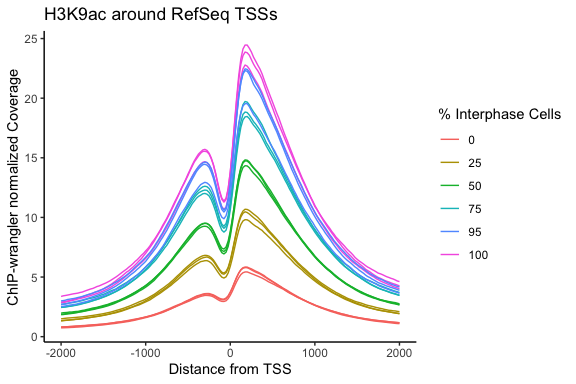

## Histogram

``` r
density_hist <- ggplot(data=iris, aes(x=Sepal.Width, fill=Species))
density_hist + 
  geom_density(stat="density", alpha=I(0.2)) + 
  xlab("Sepal Width") + 
  ylab("Density") + 
  ggtitle("Histogram & Density Curve of Sepal Width")
```

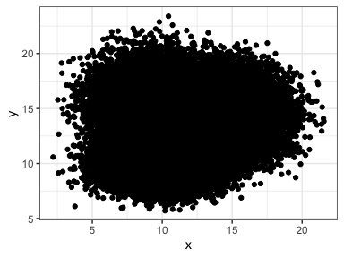

## Pie

``` r
input_presence <- data.frame(input_status = c("sufficient inputs", "some inputs missing", "no inputs present"), paper_count = c(27, 12, 14))
```

``` r
library(scales)
```


    Attaching package: 'scales'

    The following object is masked from 'package:purrr':

        discard

    The following object is masked from 'package:readr':

        col_factor

``` r
input_piechart <- ggplot(input_presence, aes(x="", y= paper_count, fill=input_status)) +
  geom_bar(stat="identity", width=1, alpha = 0.9) +
  coord_polar("y", start=0) +
  theme_void() +
  geom_text(aes(y = paper_count/3 + c(0, cumsum(paper_count)[-length(paper_count)]), 
            label = paper_count), size=5) + 
  scale_fill_manual(values = c("firebrick3", "darkorange2","goldenrod1"), name = "Status of inputs") + 
  labs(title = "Status of Non-IP Input Controls in ChIP-seq Spike-in Datasets",
       subtitle = "n = 53")

input_piechart
```


## Scatterplot

``` r
ggplot(diamonds, aes(carat, price, color = clarity)) +
  geom_point()
```

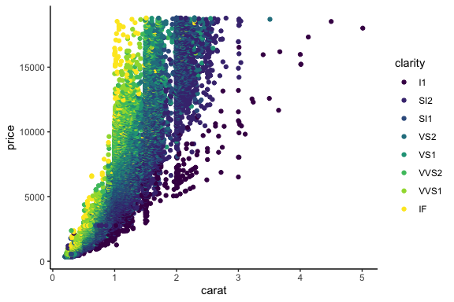

Remove outline of point (for scatterplots with many overlapping points)

``` r
ggplot(diamonds, aes(carat, price, color = clarity)) +
  geom_point(stroke = NA, alpha = 0.3)
```

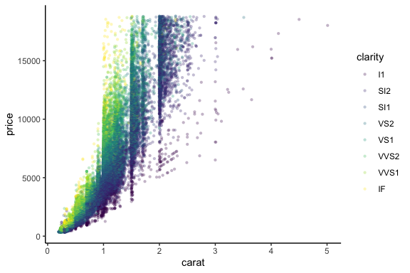

NOTE: for scatterplots the title in labs() must come first and be lower
case

## Density Scatterplots

Make some data

``` r
# Data
a <- data.frame(x=rnorm(20000, 10, 1.9), y=rnorm(20000, 10, 1.2) )
b <- data.frame(x=rnorm(20000, 14.5, 1.9), y=rnorm(20000, 14.5, 1.9) )
c <- data.frame(x=rnorm(20000, 9.5, 1.9), y=rnorm(20000, 15.5, 1.9) )
data <- rbind(a,b,c)
 
# Basic scatterplot
ggplot(data, aes(x=x, y=y) ) +
  geom_point()
```

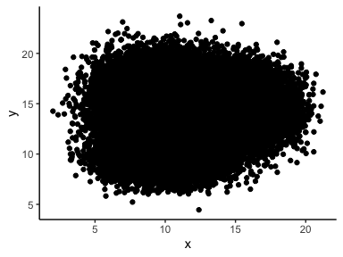

In the above graph, where is the highest density of points?

Density plots - prevent overplotting Instead we should plot a 2D
histogram

Default:

``` r
# 2d histogram with default option
ggplot(data, aes(x=x, y=y) ) +
  geom_bin2d() +
  theme_bw()
```

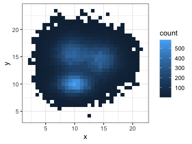

Make it pretty:

``` r
# Bin size control + color palette
ggplot(data, aes(x=x, y=y) ) +
  geom_bin2d(bins = 70) +
  scale_fill_continuous(type = "viridis") +
  theme_bw()
```

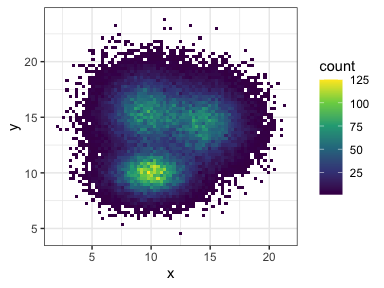

### 2D Density plot with Hex bins

``` r
ggplot(data, aes(x=x, y=y)) +
  geom_hex() +
  theme_bw()
```

    Warning: Computation failed in `stat_binhex()`.
    Caused by error in `compute_group()`:
    ! The package "hexbin" is required for `stat_bin_hex()`.

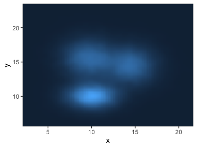

``` r
# Bin size control + color palette
ggplot(data, aes(x=x, y=y)) + 
  geom_hex(bins = 70) + 
  scale_fill_continuous(type = "viridis")
```

    Warning: Computation failed in `stat_binhex()`.
    Caused by error in `compute_group()`:
    ! The package "hexbin" is required for `stat_bin_hex()`.


### 2d distribution with geom_density_2d or stat_density_2d

Contour only

``` r
ggplot(data, aes(x=x, y=y) ) +
  geom_density_2d()
```

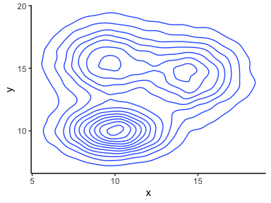

Area only

``` r
ggplot(data, aes(x=x, y=y) ) +
  stat_density_2d(aes(fill = ..level..), geom = "polygon")
```

    Warning: The dot-dot notation (`..level..`) was deprecated in ggplot2 3.4.0.
    ℹ Please use `after_stat(level)` instead.

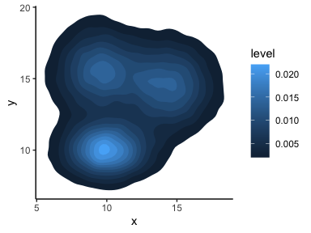

Area + Contour

``` r
ggplot(data, aes(x=x, y=y) ) +
  stat_density_2d(aes(fill = ..level..), 
                  geom = "polygon", colour="white")
```

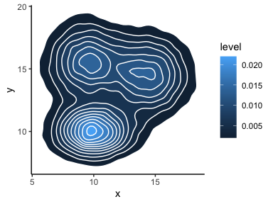

Using Raster

``` r
ggplot(data, aes(x=x, y=y) ) +
  stat_density_2d(aes(fill = ..density..), geom = "raster", contour = FALSE) +
  scale_x_continuous(expand = c(0, 0)) +
  scale_y_continuous(expand = c(0, 0)) +
  theme(
    legend.position='none'
  )
```


## Scatterplot + Smoothing Line

``` r
ggplot(diamonds, aes(carat, price, color = clarity)) +
  geom_point() +
  geom_smooth() + 
  labs(title = "Price of Diamonds by Cut and Clarity")
```

    `geom_smooth()` using method = 'gam' and formula = 'y ~ s(x, bs = "cs")'

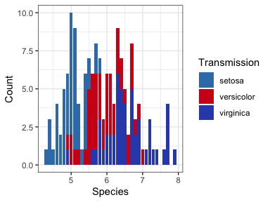

## Add Linear model

``` r
ggplot(diamonds, aes(carat, price, color = clarity)) +
  geom_point(alpha = 0.1) +
  geom_smooth(method = "lm") + 
  labs(title = "Price of Diamonds by Cut and Clarity")
```

    `geom_smooth()` using formula = 'y ~ x'

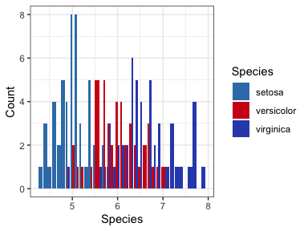

## Text Scatter Plot

``` r
# Base layer
plt_mpg_vs_wt <- ggplot(mtcars, aes(wt, mpg))

# Use text layer and map cyl to label
plt_mpg_vs_wt +
  geom_text(aes(label = mtcars$cyl)) + 
  labs(title = "MPG vs weight for Cars")
```

    Warning: Use of `mtcars$cyl` is discouraged.
    ℹ Use `cyl` instead.

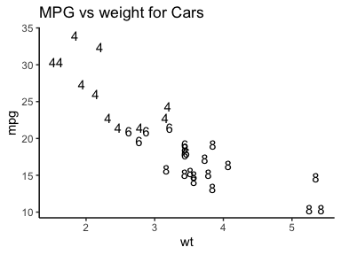

Above plot is the weight of the car vs the miles per gallon, with each
“point” being labeled with the number of cylinders the car has (a
categorical variable, values either 4, 6 or 8)

Label points with text of row names:

``` r
ggplot(mtcars, aes(wt, mpg, color = cyl)) + 
  geom_text(label = rownames(mtcars), color = "red")
```

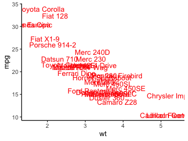

## Barplots - Stacked

``` r
ggplot(iris, aes(Sepal.Length, fill = Species)) +
  geom_bar() + 
  labs(x = "Species", y = "Sepal Length")
```

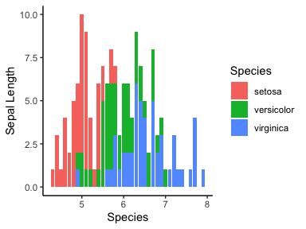

### Manual Color Scheme and Labeling

``` r
palette <- c(setosa = "#387EB8", versicolor = "#D11A1C", virginica = "#314EB9")
ggplot(iris, aes(Sepal.Length, fill = Species)) +
  geom_bar() +
  labs(x = "Species", y = "Count") +
  # Set the fill color scale
  scale_fill_manual("Transmission", values = palette)
```

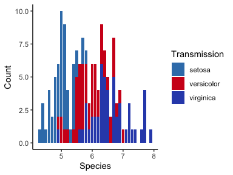

## Barplots - side by side

``` r
# Set the position
ggplot(iris, aes(Sepal.Length, fill = Species)) +
  geom_bar(position = "dodge") +
  labs(x = "Species", y = "Count") + 
  scale_fill_manual("Species", values = palette) 
```

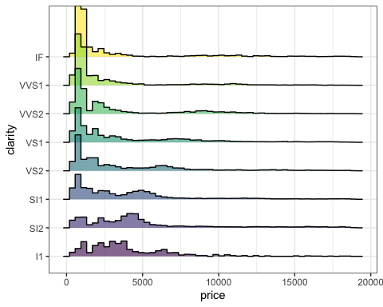

## Violin Plot

``` r
ggplot(data = diamonds, aes(x=cut, y=price, fill = cut)) + 
  geom_violin()
```

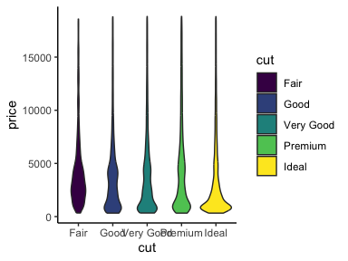

## Dotplot (2 category variables)

``` r
setwd("~/Research/R_for_fun/data_vis")
species <- read_csv("national_parks_biodiv/species.csv")
species_clean <- species %>% 
  filter(Occurrence == "Present") %>%
  rename_with(~ gsub(" ", "_", .x), contains(" "))
# removed spaces in variable names

species_clean$Park_Name <- gsub(" National Park", "", 
                                as.character(species_clean$Park_Name))
# removed "National Park" from Park_Name

acadia <- filter(species_clean, Park_Name == "Acadia")
ggplot(data = acadia) + 
  aes(x = Category, y = Abundance, color = Abundance) + 
  geom_count() + 
  labs(title = "Abundance of Biodiversity in \nAcadia National Park")
## linebreak in title
```

## Ridgeline

``` r
library(ggridges)
```

In most cases you won’t need a legend here since each row of the
ridgeline plot is clearly visible. Repress the legend with
`theme(legend.position = "none")`

``` r
ggplot(diamonds) + 
  aes(x = price, y = clarity, fill = clarity) + 
  geom_density_ridges() + 
  theme(legend.position = "none")
```

    Picking joint bandwidth of 403

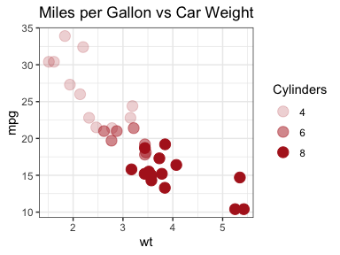

Can also make a histogram:

``` r
ggplot(diamonds) + 
  aes(x = price, y = clarity, fill = clarity) + 
  geom_density_ridges(alpha = 0.6, stat = "binline", bins = 50) + 
  theme(legend.position = "none")
```

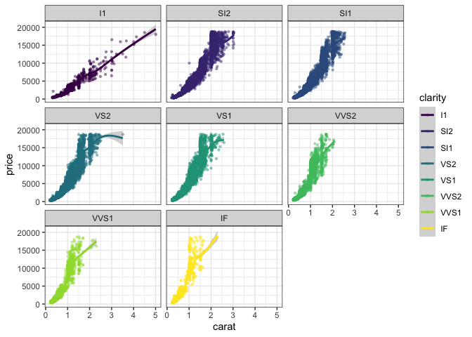

You can also map the color `fill` to a numeric variable (for instance
the price on the x axis). There are two requirements:

1.  Use `geom_density_ridges_gradient()` or `geom_ridgeline_gradient()`
2.  Instead of direcly settging the fill to a variable (ex.
    `fill = price` in the example below) you have to set it to call the
    variable you have already defined. i.e. if you want fill = price,
    and x = price, then fill = stat(x).

Also note I used log(price) because otherwise the upper outliers in
price warp the scale and no changes in color are noticeable (i.e. purely
for illustrative purposes)

``` r
ggplot(diamonds) + 
  aes(x = log(price), y = clarity, fill = stat(x)) + 
  geom_density_ridges_gradient(scale = 2) + 
  theme(legend.position = "none") + 
  scale_fill_distiller("RdYlBu")
```

    Warning: `stat(x)` was deprecated in ggplot2 3.4.0.
    ℹ Please use `after_stat(x)` instead.

    Picking joint bandwidth of 0.144

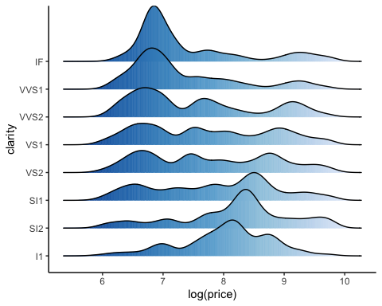

## Marginal Histograms

``` r
library(ggExtra)
```

``` r
diamonds_scatter <- ggplot(diamonds, aes(carat, price, color = clarity)) +
  geom_point() +
  labs(title = "Price of Diamonds by Cut and Clarity")

ggMarginal(diamonds_scatter, groupColour = TRUE, groupFill = TRUE)
```

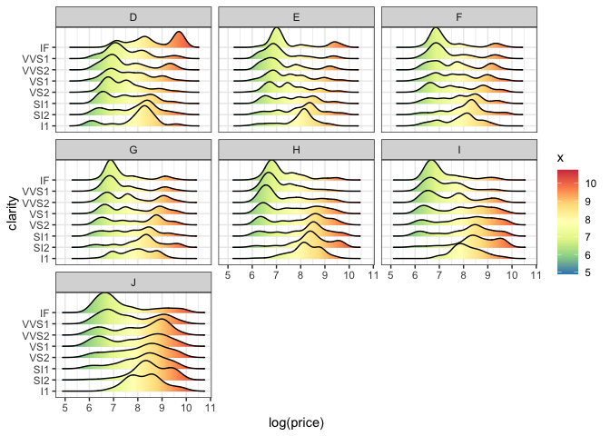

# Add-ons

## Set Properties to Categorical Variable

> In the `geom`, inside `aes()` set a property (i.e. alpha, shape, size,
> etc.) = `Categorial Variable`

> Add
> `scale_property_manual(values = c(value1, value2,etc), name = "Categorial Variable", labels = c("Category 1", "Category 2"))`
> where “property” is alpha, shape, color, etc.

A big advantage of this method is you can set the name of the legend and
the categories within the `scale_property_manual`, so if the variable
name is long/cumbersome you can make the legend easier to read

``` r
mtcars$cyl = as.factor(mtcars$cyl)
ggplot(mtcars, aes(wt, mpg, group = cyl)) + 
  geom_point(aes(alpha = cyl), color = "firebrick", size = 4) + 
  labs(title = "Miles per Gallon vs Car Weight") +
  scale_alpha_manual(values = c(0.2, 0.5, 1), name = "Cylinders", labels = c("4", "6", "8"))
```


## Faceting

### Subplots based on a categorical variable

``` r
ggplot(diamonds, aes(carat, price, color = clarity)) +
  geom_point(alpha = 0.5, stroke = NA) +
  geom_smooth() + facet_wrap(~ clarity)
```

    `geom_smooth()` using method = 'gam' and formula = 'y ~ s(x, bs = "cs")'

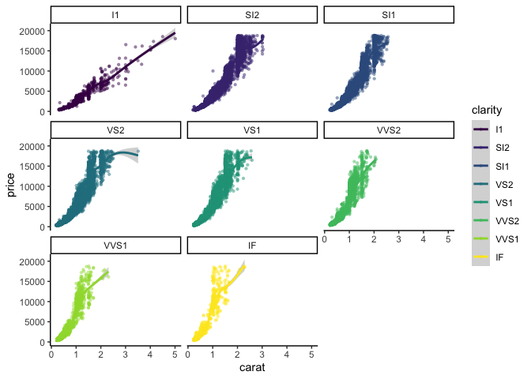

### Subplots in columns and rows (split by 2 variables)

``` r
# Base plot
insurance <- read_csv("~/Research/R_for_fun/archive/insurance.csv")
smoker_insurance <- ggplot(data = insurance) + 
  aes(x = smoker, y= charges) + 
  geom_jitter() 

# Graph by sex and region
smoker_insurance + 
  geom_jitter(aes(color = bmi)) + 
  facet_grid(cols = vars(region), rows = vars(sex))
```

### Reordering subplots:

Reordering group factor levels

``` r
data_new<- rep(c("A","B", "C", "D"), each = 5)
col2 <- rep(c("12", "10"), each = 10)
data_new$Values <- col2
```

    Warning in data_new$Values <- col2: Coercing LHS to a list

``` r
#View(data_new)
data_new$group <- factor(data_new$group,levels = c("B", "A", "C", "D"))
head(data_new)
```

    [[1]]
    [1] "A"

    [[2]]
    [1] "A"

    [[3]]
    [1] "A"

    [[4]]
    [1] "A"

    [[5]]
    [1] "A"

    [[6]]
    [1] "B"

### faceting other plot types:

``` r
ggplot(diamonds) + 
  aes(x = log(price), y = clarity) + 
  geom_density_ridges_gradient(aes(x = log(price), fill = stat(x)), alpha = 0.4) + 
  scale_fill_distiller(palette = "Spectral") + 
  facet_wrap(~ color)
```

    Picking joint bandwidth of 0.227

    Picking joint bandwidth of 0.179

    Picking joint bandwidth of 0.199

    Picking joint bandwidth of 0.194

    Picking joint bandwidth of 0.204

    Picking joint bandwidth of 0.234

    Picking joint bandwidth of 0.306

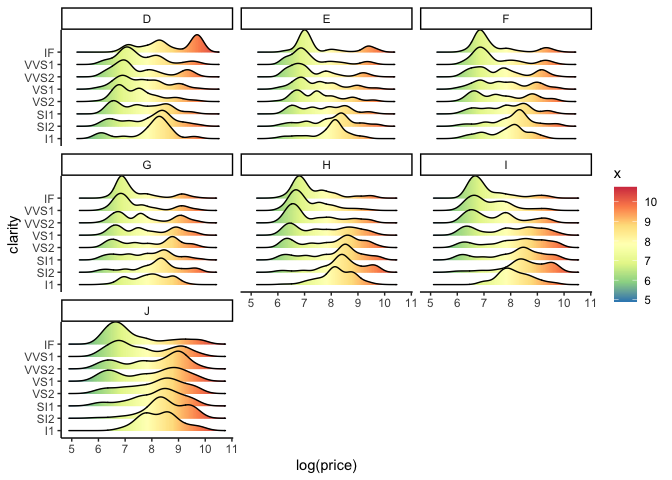

### Faceting and zooming on subset of plot

Example of a plot that needs zooming:

``` r
public_data_submit_revisions <- read.delim("~/Research/spike_commentary/public_data_submit_revisions.tsv")

public_data_submit_revisions$filtered.spike_target <- as.numeric(public_data_submit_revisions$filtered.spike_target)

public_data_submit_revisions <- public_data_submit_revisions %>%
  group_by(Author) %>%
  drop_na(filtered.spike_target) %>%
  mutate(inputvar = (filtered.spike_target)/min(filtered.spike_target)) %>%
  mutate(meanvar = mean(inputvar))
```

``` r
public_data_submit_revisions <- public_data_submit_revisions %>%
  arrange(meanvar) %>%
  group_by(Author = factor(Author, levels = unique(Author))) %>%
  mutate(group = cur_group_id())
```

``` r
public_data_submit_revisions %>% 
  drop_na(inputvar) %>% group_by(Author) %>%
  arrange(meanvar) %>%
  ggplot() + 
  aes(x = as.factor(group), y = inputvar) + 
  geom_jitter(size = 4, alpha = 0.5, width = 0.2) + 
  geom_hline(yintercept = 1) + 
  labs(title = "Variation in input spike-in/target chromatin ratios", 
       y = "input/target", x = "Dataset") + 
  theme(legend.position = "none")
```

``` r
library(ggforce)
public_data_submit_revisions %>% 
  drop_na(filtered.spike_target) %>% ggplot() + 
  aes(x = as.factor(group), y = inputvar) + 
  geom_jitter(size = 6, alpha = 0.6, width = 0.1) + 
  geom_hline(yintercept = 1) + 
  labs(title = "Variation in input spike-in/target chromatin ratios", y = "Relative ratio of inputs within a dataset", 
       x = "Dataset") + 
  facet_zoom(ylim = c(0.7, 2.5))
```

Better way: break plot with facets into 1-19, then 20-23, and scale axes

1)  can get break in rows, while scaling equally

- scales = “free_x” removes the empty entries in each facet
- space = “free” scales each facet by the range of x values, keeps them
  proportional

``` r
library(ggh4x)
library(RColorBrewer)

public_data_submit_revisions %>% 
  drop_na(inputvar) %>% ggplot() + 
  aes(x = as.factor(group), y = inputvar) + 
  geom_jitter(size = 3.5, alpha = 0.6, width = 0.17, color = "navy", pch=21, fill = "dodgerblue2", stroke = 1.5) + 
  geom_hline(yintercept = 1) + 
  labs(title = "Variation in input spike-in/target chromatin ratios", 
       y = "Relative ratio of inputs within a dataset",
       x = "Dataset") + 
  ggh4x::facet_grid2(~ group > 26, scales = "free", independent = "y", space = "free") +
   scale_color_manual(
      values = colorRampPalette(brewer.pal(9, "YlGnBu"))(13)[1:13])
```

## Positioning

### Scatterplot positioning

Default

``` r
ggplot(iris) + 
  aes(Sepal.Length, Sepal.Width, color = Species) +
  geom_point()
```

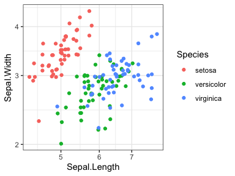

Jitter

``` r
ggplot(iris) +
  aes(Sepal.Length, Sepal.Width, color = Species) + 
  geom_jitter()
```

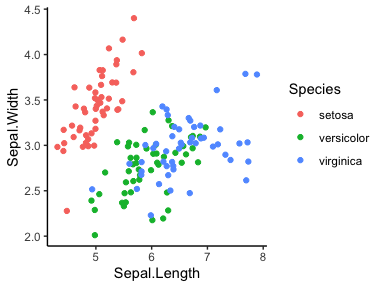

Or

``` r
ggplot(iris) + 
  aes(Sepal.Length, Sepal.Width, color = Species) + 
  geom_point(position= "jitter")
```

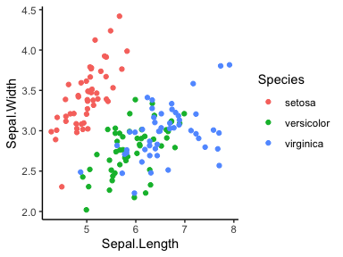

### Legend positioning

Use `legend.position = c([HORIZONTAL], [VERTICAL])` where

1.  \[HORIZONTAL\] = integer from (0, 1), 0 left, 1 right
2.  \[VERTICAL\] = integer from (0, 1), 0 bottom, 1 top

``` r
ggplot(iris) + 
  aes(Sepal.Length, Sepal.Width, color = Species) +
  geom_point() + 
  coord_cartesian(ylim = c(2,5)) + 
  theme(legend.position = c(0.85, 0.83))
```

    Warning: A numeric `legend.position` argument in `theme()` was deprecated in ggplot2
    3.5.0.
    ℹ Please use the `legend.position.inside` argument of `theme()` instead.


Add border to legend if inside graph to reduce chance of
misinterpretation:

``` r
ggplot(iris) + 
  aes(Sepal.Length, Sepal.Width, color = Species) +
  geom_point() + 
  coord_cartesian(ylim = c(2,5)) + 
  theme(legend.position = c(0.85, 0.83), 
                            legend.background = element_rect(
                                    linewidth=0.7, linetype="solid", 
                                    colour ="grey20"))
```


## Plot on log scale

Plot_type + scale_x_log10() + scale_y_log10()

``` r
ggplot(iris) + 
  aes(Sepal.Length, Sepal.Width, color = Species) + 
  geom_point(position= "jitter") + 
  scale_x_log10() + scale_y_log10()
```


## Set x and y axes

### Strategy 1: Scale_x_continuous

Remove points outside the viewing window (will affect regression lines,
etc)

`plot + scale_x_continuous(limits = c(xmin, xmax)) + scale_y_continuous(limits = c(ymin, ymax))`

``` r
ggplot(iris) +
  aes(Sepal.Length, Sepal.Width, group = Species, color = Species) +
  geom_point(position= "jitter") + 
  scale_x_continuous(limits = c(4, 7)) + 
  scale_y_continuous(limits = c(1, 5))
```

    Warning: Removed 12 rows containing missing values or values outside the scale range
    (`geom_point()`).

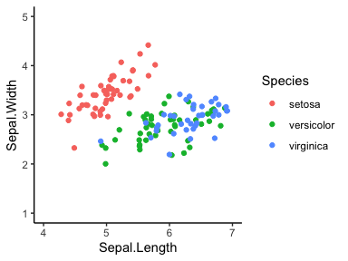

### Strategy 2: coord_cartesian

Set viewing window without removing points that may fall outside (they
just won’t be visible)

`plot + coord_cartesian(xlim=c(xmin, xmax), ylim=c(ymin, ymax))`

``` r
ggplot(iris) + 
  aes(Sepal.Length, Sepal.Width, group = Species, color = Species) + 
  geom_point(position= "jitter") + 
  coord_cartesian(xlim = c(4, 7), ylim = c(1, 5))
```


## Add regression line

`Plot_object + geom_smooth(method=lm)`

For multiple regression lines by group, set `group = Species` within
`aes()`

``` r
ggplot(iris) + 
  aes(Sepal.Length, Sepal.Width, group = Species, color = Species) + 
  geom_point(position= "jitter") + 
  geom_smooth(method = lm, fill = NA)
```

    `geom_smooth()` using formula = 'y ~ x'

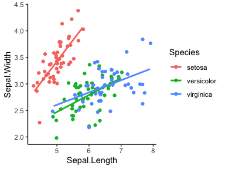

## Add x = y line

`Plot_object + geom_abline()`

## Manual tick lines

`plot_object + scale_y_continuous(breaks=seq(ymin, ymax, interval))`

# Coloring

## `Viridis` Colorblind-friendly library

Add with `library(viridis)`

``` r
library(viridis)
```

    Loading required package: viridisLite


    Attaching package: 'viridis'

    The following object is masked from 'package:scales':

        viridis_pal

### Continuous Color Schemes

Plotting for continuous variables

``` r
smoker_insurance + 
  geom_jitter(aes(color = bmi)) + 
  facet_grid(cols = vars(region), rows = vars(sex)) + 
  scale_color_viridis(option = "magma")
```

### Discrete Color Schemes

``` r
knitr::include_graphics("C:\\Users\\lhodg\\Documents\\Research\\R_for_fun\\data_vis\\viridis_discrete.png")
```

Plotting for Discrete color schemes, make sure to set `discrete = TRUE`

``` r
ggplot(data = acadia) + 
  aes(x = Category, y = Abundance, color = Abundance) + 
  geom_count() + 
  labs(title = "Abundance of Biodiversity in Acadia National Park") +
  scale_color_viridis(option = "magma", discrete = TRUE)
```

## R Color Brewer

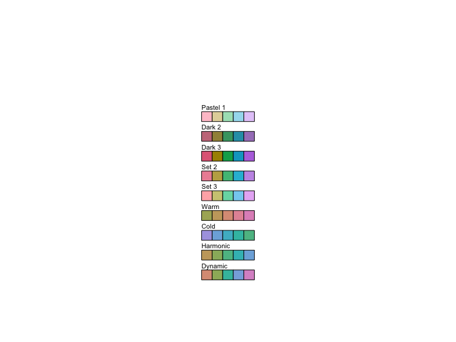

Get hex codes from the color schemes:

``` r
brewer.pal(n=5,"Set1")
```

    [1] "#E41A1C" "#377EB8" "#4DAF4A" "#984EA3" "#FF7F00"

Extend colors (if you need more colors, or want to exclude upper/lower
colors)

``` r
colorRampPalette(brewer.pal(9, "YlGnBu"))(12)[4:11]
```

    [1] "#B9E3B5" "#85CFBA" "#57BEC0" "#33A8C2" "#1D8CBD" "#2167AC" "#23479D"
    [8] "#1D2D83"

``` r
ggplot(data = acadia) + 
  aes(x = Category, y = Abundance, color = Abundance) + 
  geom_count() + 
  labs(title = "Abundance of Biodiversity in Acadia National Park") +
  scale_color_manual(
      values = colorRampPalette(brewer.pal(9, "YlGnBu"))(10)[3:9],
      name = "Abundance")
```

## non Rcolorbrewer palettes

``` r
library(grDevices) # library for color palettes
library(unikn) # library needed for plot below
```

    Welcome to unikn (v1.0.0)!

    unikn.guide() opens user guides.

``` r
n <- 10

h1 <- hcl.colors(n, palette = "Dynamic")
h2 <- hcl.colors(n, palette = "Earth")
h3 <- hcl.colors(n, palette = "Terrain")
h4 <- hcl.colors(n, palette = "Berlin")
h5 <- hcl.colors(n, palette = "Oslo")
h6 <- hcl.colors(n, palette = "Lajolla")
h7 <- hcl.colors(n, palette = "Cork")
h8 <- hcl.colors(n, palette = "Vik")
h9 <- hcl.colors(n, palette = "Fall")
h10 <- hcl.colors(n, palette = "Sunset")
h11 <- hcl.colors(n, palette = "Purple-Orange")
h12 <- hcl.colors(n, palette = "Dark-Mint")
h13 <- hcl.colors(n, palette = "Peach")
h15 <- hcl.colors(n, palette = "Roma")

seecol(list(h1, h2, h3, h4, h5, h6, h7, h8, h9, h10, h11, h12, h13, h15), 
       col_brd = "white", lwd_brd = 4, 
       title = "hcl.colors NOT in RColorBrewer (n = 10)", 
       pal_names = c("Dynamic", "Earth", "Terrain", "Berlin", "Oslo", "Lajolla", "Cork", "Vik", "Fall", "Sunset", "Purple-Orange", "Dark-Mint", "Peach", "Roma"))
```

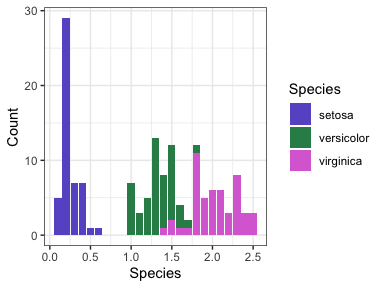

See all hcl palettes:

``` r
hcl.pals()
```

      [1] "Pastel 1"      "Dark 2"        "Dark 3"        "Set 2"        
      [5] "Set 3"         "Warm"          "Cold"          "Harmonic"     
      [9] "Dynamic"       "Grays"         "Light Grays"   "Blues 2"      
     [13] "Blues 3"       "Purples 2"     "Purples 3"     "Reds 2"       
     [17] "Reds 3"        "Greens 2"      "Greens 3"      "Oslo"         
     [21] "Purple-Blue"   "Red-Purple"    "Red-Blue"      "Purple-Orange"
     [25] "Purple-Yellow" "Blue-Yellow"   "Green-Yellow"  "Red-Yellow"   
     [29] "Heat"          "Heat 2"        "Terrain"       "Terrain 2"    
     [33] "Viridis"       "Plasma"        "Inferno"       "Rocket"       
     [37] "Mako"          "Dark Mint"     "Mint"          "BluGrn"       
     [41] "Teal"          "TealGrn"       "Emrld"         "BluYl"        
     [45] "ag_GrnYl"      "Peach"         "PinkYl"        "Burg"         
     [49] "BurgYl"        "RedOr"         "OrYel"         "Purp"         
     [53] "PurpOr"        "Sunset"        "Magenta"       "SunsetDark"   
     [57] "ag_Sunset"     "BrwnYl"        "YlOrRd"        "YlOrBr"       
     [61] "OrRd"          "Oranges"       "YlGn"          "YlGnBu"       
     [65] "Reds"          "RdPu"          "PuRd"          "Purples"      
     [69] "PuBuGn"        "PuBu"          "Greens"        "BuGn"         
     [73] "GnBu"          "BuPu"          "Blues"         "Lajolla"      
     [77] "Turku"         "Hawaii"        "Batlow"        "Blue-Red"     
     [81] "Blue-Red 2"    "Blue-Red 3"    "Red-Green"     "Purple-Green" 
     [85] "Purple-Brown"  "Green-Brown"   "Blue-Yellow 2" "Blue-Yellow 3"
     [89] "Green-Orange"  "Cyan-Magenta"  "Tropic"        "Broc"         
     [93] "Cork"          "Vik"           "Berlin"        "Lisbon"       
     [97] "Tofino"        "ArmyRose"      "Earth"         "Fall"         
    [101] "Geyser"        "TealRose"      "Temps"         "PuOr"         
    [105] "RdBu"          "RdGy"          "PiYG"          "PRGn"         
    [109] "BrBG"          "RdYlBu"        "RdYlGn"        "Spectral"     
    [113] "Zissou 1"      "Cividis"       "Roma"         

``` r
hcl.swatch <- function(type = NULL, n = 5, nrow = 11,
  border = if (n < 15) "black" else NA) {
    palette <- hcl.pals(type)
    cols <- sapply(palette, hcl.colors, n = n)
    ncol <- ncol(cols)
    nswatch <- min(ncol, nrow)

    par(mar = rep(0.1, 4),
        mfrow = c(1, min(5, ceiling(ncol/nrow))),
        pin = c(1, 0.5 * nswatch),
        cex = 0.7)

    while (length(palette)) {
        subset <- 1:min(nrow, ncol(cols))
        plot.new()
        plot.window(c(0, n), c(0, nrow + 1))
        text(0, rev(subset) + 0.1, palette[subset], adj = c(0, 0))
        y <- rep(subset, each = n)
        rect(rep(0:(n-1), n), rev(y), rep(1:n, n), rev(y) - 0.5,
             col = cols[, subset], border = border)
        palette <- palette[-subset]
        cols <- cols[, -subset, drop = FALSE]
    }

    par(mfrow = c(1, 1), mar = c(5.1, 4.1, 4.1, 2.1), cex = 1)
}
hcl.swatch("qualitative")
```


``` r
hcl.swatch("sequential")
```


``` r
hcl.swatch("diverging")
```

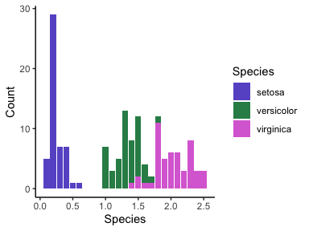

``` r
hcl.swatch("divergingx")
```

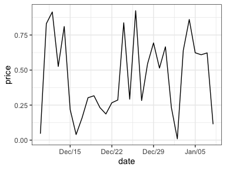

## Manual Color Scheme and Labeling

``` r
# Define your palette of choice
iris_palette <- c(setosa = "slateblue", versicolor = "seagreen", virginica = "orchid")

# Plot using your palette, the first argument in scale_fill_manual is the legend title
ggplot(iris, aes(Petal.Width, fill = Species)) +
  geom_bar() +
  labs(x = "Species", y = "Count") +
  scale_fill_manual("Species", values = iris_palette)
```


# Labels

All Font Sizes Any \## indicates numerical input, XX indicates text
input

> `Plot_object + theme(axis.text.x = element_text(size=##), axis.text.y = element_text(size=##), axis.title = element_text(size=##), etc.)`

Options for text size changing:

1.  axis.text.x
2.  axis.text.y
3.  strip.text.x : text in facet labels

## custom legend labels

For line/dot plots: `scale_color_discrete` or `scale_color_manual`

> `scale_color_discrete(name = "Legend Title", labels = c("label1", "label2", "label3", "75%","95%", "100%"))`

Example

``` r
ggplot(iris) +
  aes(Sepal.Length, Sepal.Width, group = Species, color = Species) +
  geom_point() + 
  scale_color_manual(
    name = "Species", 
    labels = c("Setosa", "Versicolor", "Virginica"), 
    values = c("slateblue", "seagreen", "orchid")
  )
```

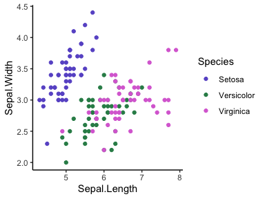

For bar/violin/similar: `scale_fill_discrete`

## rotate labels

> `Plot_object + theme(axis.text.x = element_text(angle = 90, vjust = 0.5, hjust=1))`

## Format Date Labels

Standard date format: `yyyy-mm-dd`

Make a time series dataset:

``` r
set.seed(1234)
last_month <- Sys.Date() - 0:29
df <- data.frame(
  date = last_month,
  price = runif(30)
)
```

Plot:

``` r
ggplot(data=df, aes(x = date, y = price)) +
  geom_line()
```

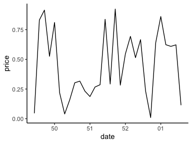

Format dates:

- Weekday name: use %a and %A for abbreviated and full weekday name,
  respectively
- Month name: use %b and %B for abbreviated and full month name,
  respectively
- %d: day of the month as decimal number
- %U: week of the year as decimal number (00-53)
- %Y: Year with century

``` r
ggplot(data=df, aes(x = date, y = price)) +
  geom_line() + 
  scale_x_date(date_labels = "%b/%d")
```

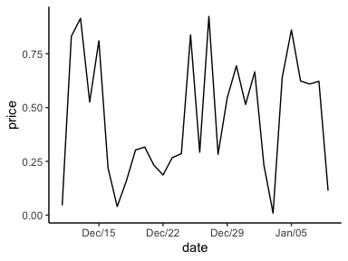

``` r
ggplot(data=df, aes(x = date, y = price)) +
  geom_line() + scale_x_date(date_labels = "%U")
```

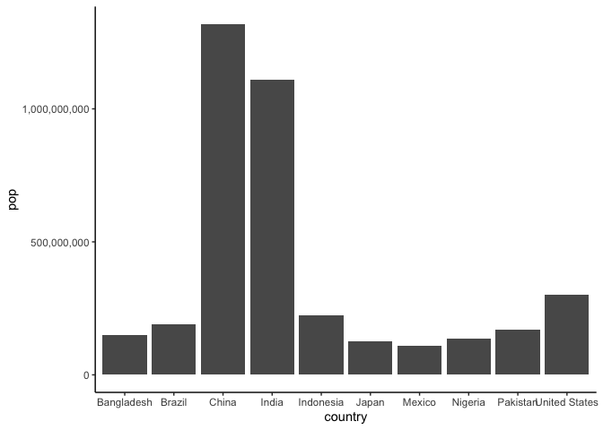

## format axes numbers

### sci notation -\> full numbers

``` r
options(scipen = 999)
library(gapminder)
ggplot(data = gapminder %>% filter(year == 2007) %>% arrange(-pop) %>% top_n(10, wt = pop)) + 
  aes(x = country, y = pop) + 
  geom_bar(stat = "identity")
```

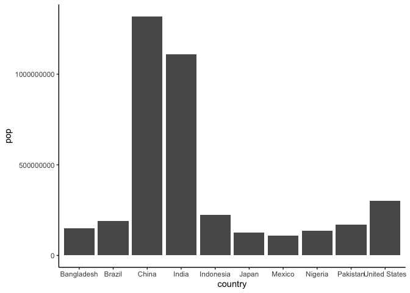

### full numbers -\> Add commas

`scale_y_continuous(labels = scales::comma)`

``` r
ggplot(data = gapminder %>% filter(year == 2007) %>% arrange(-pop) %>% top_n(10, wt = pop)) + 
  aes(x = country, y = pop) + 
  geom_bar(stat = "identity") +
  scale_y_continuous(labels = scales::comma)
```

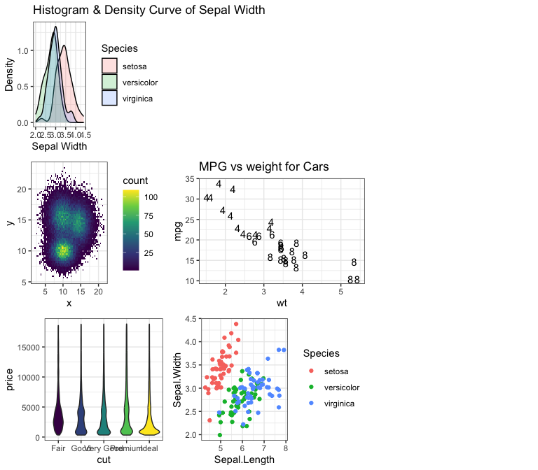

### Full numbers -\> Millions or Billions

`labels = scales::label_number_si()`

``` r
ggplot(data = gapminder %>% filter(year == 2007) %>% arrange(-pop) %>% top_n(10, wt = pop)) + 
  aes(x = country, y = pop) + 
  geom_bar(stat = "identity") +
  scale_y_continuous(labels = scales::label_number(scale_cut == cut_number()))
```

## Linebreak in plot labels

`title = "text here \ntext here"`

``` r
acadia <- filter(species_clean, Park_Name == "Acadia")
ggplot(data = acadia) + 
  aes(x = Category, y = Abundance, color = Abundance) + 
  geom_count() + 
  labs(title = "Abundance of Biodiversity in \nAcadia National Park")
```

# Combining plots

## GridExtra - Gridarrange

``` r
library(gridExtra)
```


    Attaching package: 'gridExtra'

    The following object is masked from 'package:dplyr':

        combine

Some dummy plots

``` r
p1 <- ggplot(data=iris) + 
  aes(x=Sepal.Width, fill=Species) + 
  geom_density(stat="density", alpha=I(0.2)) + 
  xlab("Sepal Width") + ylab("Density") + 
  ggtitle("Histogram & Density Curve of Sepal Width")
  
p2 <- ggplot(data, aes(x=x, y=y) ) +
  geom_bin2d(bins = 70) +
  scale_fill_continuous(type = "viridis") +
  theme_bw()
  
p3 <- plt_mpg_vs_wt +
  geom_text(aes(label = mtcars$cyl)) + 
  labs(title = "MPG vs weight for Cars")

p4 <- ggplot(data = diamonds) + 
  aes(x=cut, y=price, fill = cut) +
  geom_violin() + 
  theme(legend.position = "none")
  

p5 <- ggplot(iris) +  
  aes(Sepal.Length, Sepal.Width, color = Species) + 
  geom_jitter()
```

Combine with `grid.arrange`

``` r
# make a matrix of the layout - NA's are empty placeholders, each vector makes a row
lay <- rbind(c(1, NA, NA),
             c(2, 3, NA), 
             c(4, 5, NA))

# gridarrange takes the plots (in order of the layout matrix) then the layout matrix
# can also set custom widths/heights for each row if you want
grid.arrange(p1, p2, p3, p4, p5,
  layout_matrix = lay, 
  widths = c(5,6,5))
```

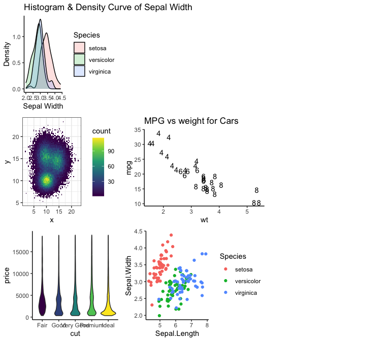
